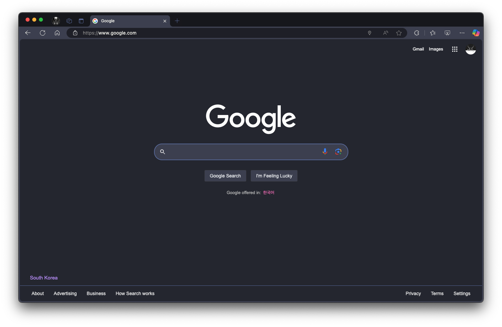
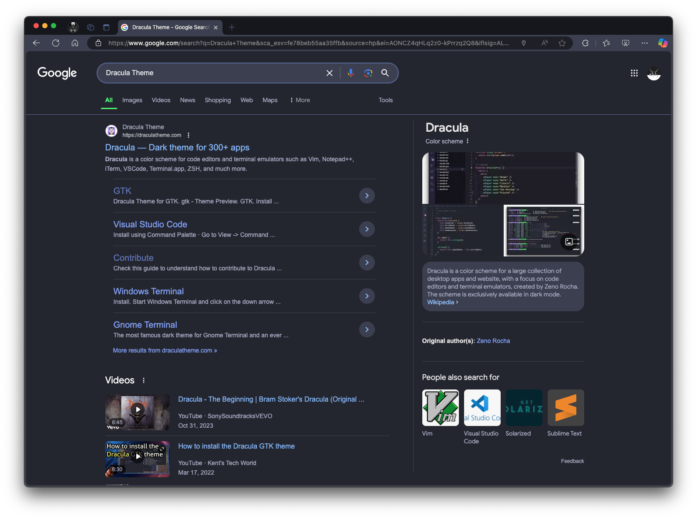
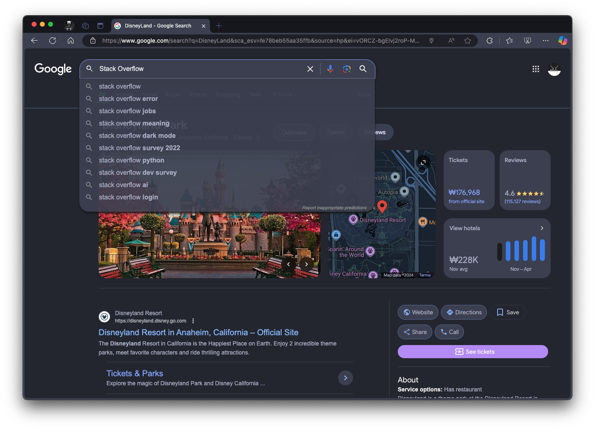

# Dracula for [Google](https://www.google.com)

> A dark theme for [Google](https://www.google.com).

## Install

All instructions can be found at [draculatheme.com/google](https://draculatheme.com/google).

- If you don’t have the Stylus extension installed in your browser, visit the following link to install it: [Link](https://chromewebstore.google.com/detail/stylus/clngdbkpkpeebahjckkjfobafhncgmne)
- Click “Install” at [Link](https://userstyles.world/style/19469/google-dracula) to apply the theme to your browser.

enjoy! 😆

## Team

This theme is maintained by the following person(s) and a bunch of [awesome contributors](https://github.com/dracula/foobar/graphs/contributors).

|  |
| -------------------------------------------- |
| [DokaDev](https://github.com/dokadev)        |

## Community

- [Twitter](https://twitter.com/draculatheme) - Best for getting updates about themes and new stuff.
- [GitHub](https://github.com/dracula/dracula-theme/discussions) - Best for asking questions and discussing issues.
- [Discord](https://draculatheme.com/discord-invite) - Best for hanging out with the community.

## Dracula PRO

## License

[MIT License](./LICENSE)
